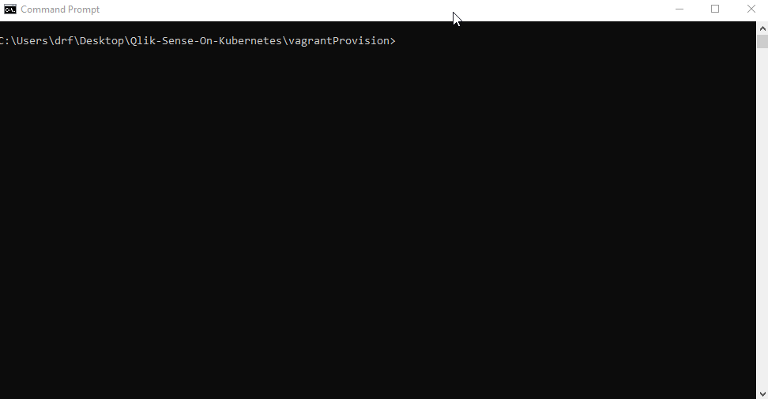

# Qlik Sense Enterprise On Kubernetes (QSEoK)
This will automate the provisioning of a local minikube (a non-production single-node Kubernetes) virtual machine in VirtualBox with Qlik Sense Enterprise using Vagrant. The purpose of this fork is to further simply things and to build on the great work that has been done already. This fork will also attempt to provide the latest guest OS, Kubernetes, Docker, and other components as supported requirements permit. An this brings us to our next sections.

Releases: [https://github.com/StevenJDH/Qlik-Sense-On-Kubernetes/releases](https://github.com/StevenJDH/Qlik-Sense-On-Kubernetes/releases)

## Host system requirements
* Hardware assisted visualization. Type `systeminfo` in the Command window and ensure you see a `Yes` for each item under the "Hyper-V Requirements" section.
* A 64-bit multi-core CPU, preferably a quad-core.
* At least 8GB of RAM, although a minimum of 16GB is preferable.
* Internet access, preferably a fast one.
* More than 10GB of free disc space.

## Prerequisites
* A license from Qlik that is enabled for Multi-Cloud (a.k.a. Qlik Sense Enterprise for Kubernetes)
* [Vagrant](https://www.vagrantup.com/downloads.html) installed, and ensure that you reboot your system.
* [VirtualBox](https://www.virtualbox.org/wiki/Downloads) 6.0.x only installed, since this is the latest supported by Vagrant.

## How to use the script
Open a Command window and change the working directory to the vagrantProvision folder. Then, type the following and grab some popcorn:

      > vagrant up

To get terminal window access for the underlying Linux distribution, type:

      > vagrant ssh

To get back into your host system prompt, type:

      $ exit

If you want to stop and remove the VM properly (also if you want to restart the provisioning process), type:

      > vagrant destroy

To remove all failed pods use, type:

      $ kubectl get pods --all-namespaces | grep -E 'ImagePullBackOff|ErrImagePull|Evicted|Error|Completed' | awk '{ if(NR>1)print $2}' | xargs kubectl delete pods

## First time login
Once everything is set up and all pods are running (check with: kubectl get pods), you can navigate your browser to [https://elastic.example:32443/console](https://elastic.example:32443/console). If everything is correct you will be redirected to port :32123 for login. For simplicity reasons, the installation of QSEoK will use the built-in user authentication (no 3rd-party Identity Provider). Choose one of the users below. Remember: the first one to log in to a fresh installation will be the site administrator (TenentAdmin). 
  
 * user: `harley@qlik.example`, password: `Password1!`
 * user: `barb@qlik.example`, password: `Password1!`
 * user: `sim@qlik.example`, password: `Password1!`	
 * For more users, see [https://support.qlik.com/articles/000076585](https://support.qlik.com/articles/000076585)

Next you will get back to [https://elastic.example:32443/console](https://elastic.example:32443/console) where you'll have a box to enter the site license (a JWT token you got from your Qlik representative). Once applied, you may see "unauthorized" and may have to re-login. That is only once after the site license has been set. 

[https://elastic.example:32443/explore](https://elastic.example:32443/explore) will show the new hub. You can create or upload apps there.

## Encountering problems?
If you are having issues with running the script or with Qlik Sense, please check the Wiki for help and additional information as it becomes available.

## Do you have any questions?
Many commonly asked questions are answered in the FAQ:
[https://github.com/StevenJDH/Code-Librarian/wiki/FAQ](https://github.com/StevenJDH/Code-Librarian/wiki/FAQ)

## Need to contact me?
I can be reached here directly at [https://21.co/stevenjdh](https://21.co/stevenjdh "Contact Page")

## Want to show your support?

|Method       | Address                                                                                                    |
|------------:|:-----------------------------------------------------------------------------------------------------------|
|PayPal:      | [https://www.paypal.me/stevenjdh](https://www.paypal.me/stevenjdh "Steven's Paypal Page")                  |
|Bitcoin:     | 3GyeQvN6imXEHVcdwrZwKHLZNGdnXeDfw2                                                                         |
|Litecoin:    | MAJtR4ccdyUQtiiBpg9PwF2AZ6Xbk5ioLm                                                                         |
|Ethereum:    | 0xa62b53c1d49f9C481e20E5675fbffDab2Fcda82E                                                                 |
|Dash:        | Xw5bDL93fFNHe9FAGHV4hjoGfDpfwsqAAj                                                                         |
|Zcash:       | t1a2Kr3jFv8WksgPBcMZFwiYM8Hn5QCMAs5                                                                        |
|PIVX:        | DQq2qeny1TveZDcZFWwQVGdKchFGtzeieU                                                                         |
|Ripple:      | rLHzPsX6oXkzU2qL12kHCH8G8cnZv1rBJh Destination Tag: 2357564055                                        |
|Monero:      | 4GdoN7NCTi8a5gZug7PrwZNKjvHFmKeV11L6pNJPgj5QNEHsN6eeX3D &#8618;aAQFwZ1ufD4LYCZKArktt113W7QjWvQ7CWDXrwM8yCGgEdhV3Wt|

// Steven Jenkins De Haro ("StevenJDH" on GitHub)